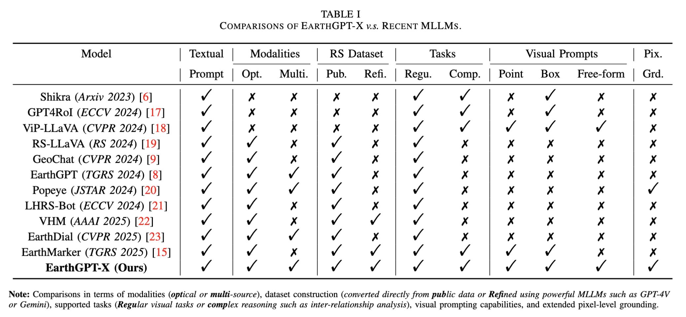

# EarthGPT-X
  
## :mega: News
- The code, dataset, and Chatbot are coming soon!
* [2025.04.17]: The paper for EarthMarker is released [arxiv](https://arxiv.org/pdf/2504.12795). 🚀 

##  :sparkles: Introduction
We introduce EarthGPT-X, the first MLLM designed for multi-level spatial understanding of multi-source remote sensing (RS) imagery (optical, SAR, infrared). It advances beyond existing RS MLLMs by supporting free-form visual prompts (e.g., points, boxes, scribbles) to enable flexible multi-granularity interpretation. EarthGPT-X unifies diverse spatial reasoning tasks into a visual prompting framework, providing a generalizable understanding across heterogeneous RS data.
 

  

 

  

##  :sparkles: The First Multi-source Multi-level Visual Prompting Dataset 

Coming soon!

## :envelope: Contact
If you have any questions about EarthGPT-X, please feel free to contact w.w.zhanger@gmail.com.
